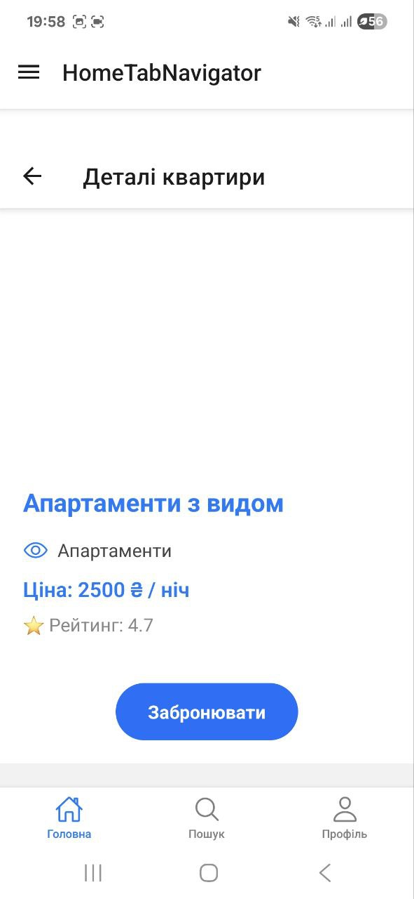
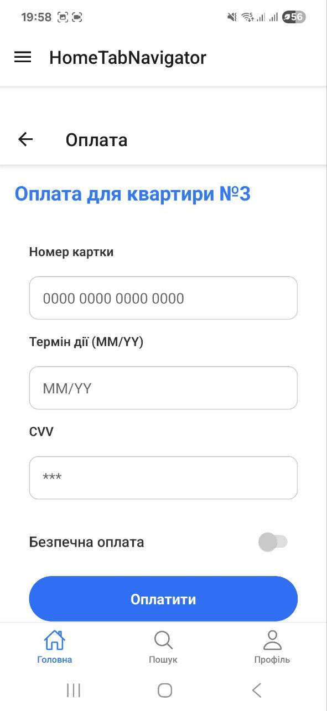
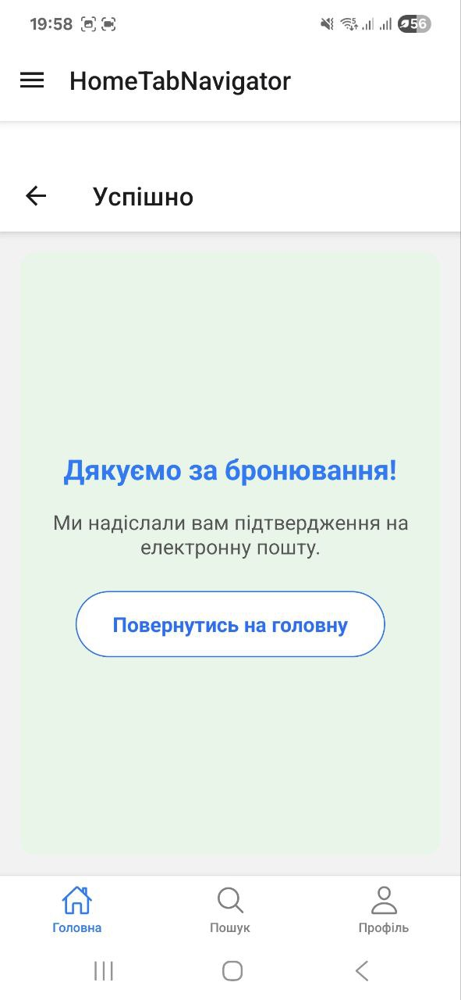
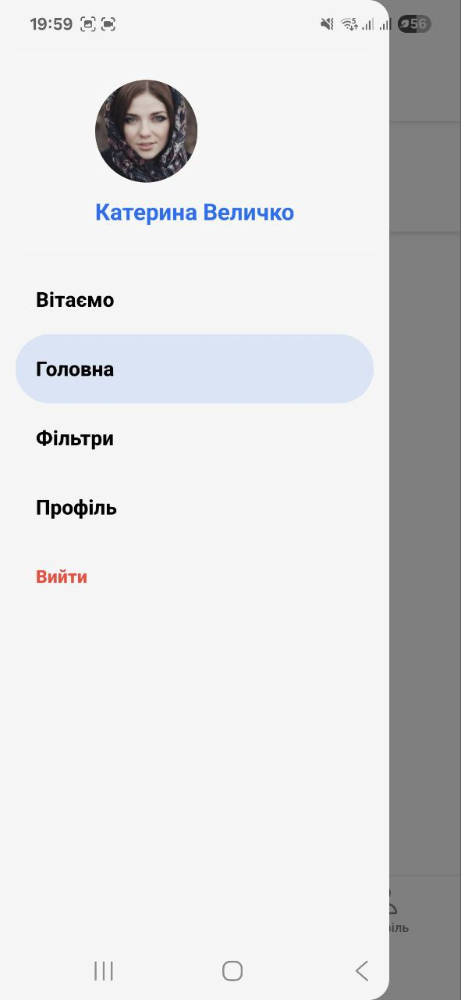

# EasyRent

EasyRent — мобільний застосунок для оренди квартир, реалізований з використанням **React Native + React Navigation**. У цьому завданні реалізовано повноцінну **навігаційну систему** з підтримкою:

- **Stack Navigation** — для переходів між екранами.
- **Tab Navigation** — для основних розділів.
- **Drawer Navigation** — для додаткових функцій.

## 📂 Структура навігації

RootNavigator (Stack)
├── TabNavigator (Tab)
│ ├── LandingScreen
│ ├── ApartmentsListScreen
│ ├── SearchScreen
│ └── ProfileScreen
├── DetailsScreen (apartmentId)
├── BookingFormScreen
├── PaymentScreen
├── SuccessScreen
└── DrawerNavigator (Drawer)
├── SettingsScreen
├── HelpScreen
└── AboutScreen

## 🛠️ Технології

- **React Native**
- **React Navigation v6**
- `@react-navigation/native`
- `@react-navigation/native-stack`
- `@react-navigation/bottom-tabs`
- `@react-navigation/drawer`
- `expo`
- `@expo/vector-icons`

## 🔄 Передача параметрів

Передача apartmentId між екранами:

navigation.navigate('DetailsScreen', { apartmentId: item.id });
Обробка параметра:

const { apartmentId } = route.params;

💅 Стилізація
Власний компонент Header.js з назвою екрану та кнопкою "Назад".

Вкладки мають іконки з @expo/vector-icons.

Drawer-меню має стилізацію

Скриншоти
TabNavigator (Tab)
│ ├── LandingScreen
│ ├── ApartmentsListScreen

│ ├── SearchScreen

│ └── ProfileScreen

DetailsScreen (apartmentId)

├── BookingFormScreen

├── PaymentScreen

├── SuccessScreen

└── DrawerNavigator (Drawer)

Віде роботи навігації в застосунку
<video controls src="img/video_2025-06-16_20-00-55.mp4" title="Title"></video>

📁 Структура проєкту

/components
Header.js
/constants
screens.js
/navigation
RootNavigator.js
StackNavigator.js
TabNavigator.js
DrawerNavigator.js
/screens
\*.js
App.js
